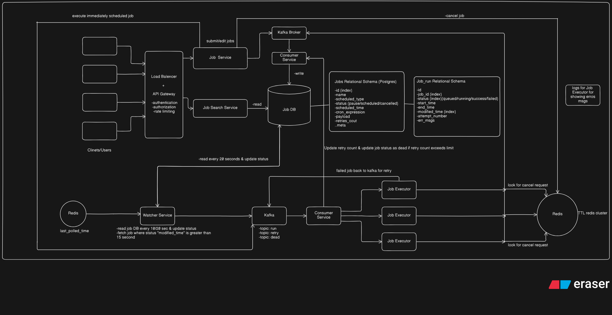

# Distributed Job Scheduler

> **A note for evaluators** — thank you for taking the time to review this
> project. Every piece below (architecture, schema, API surface, and the
> trade-offs behind them) is documented, live-verified, and tied back to a
> commit. Jump to whichever deliverable is most useful, or start with the
> [architecture diagram](#architecture) for the full picture in one glance.

## Deliverables

| Deliverable | Where to find it |
|---|---|
| Source code + setup instructions | This README (below) |
| Architecture diagram | [Architecture](#architecture) below, full write-up in [`docs/architecture.md`](docs/architecture.md) |
| ER diagram | Pending — see [`docs/database-schema.md`](docs/database-schema.md) for the schema it will diagram |
| API documentation | [`docs/api-design.md`](docs/api-design.md) |
| Design decisions | [`docs/design-decisions.md`](docs/design-decisions.md) |
| Automated tests | `go test ./...` (see [Build / test](#build--test)); test files live next to the code they cover (`internal/*/*_test.go`) |

## Architecture



Auth + project management, plus the full job-scheduling core: queues,
retry policies, jobs, workers, execution logs, a dead letter queue, and
recurring (cron) jobs. See `docs/` for the full architecture and
`docs/design-decisions.md`'s "MVP bootstrap ledger" for what's
implemented and how it was verified.

## Run it

Full stack, HTTPS included (Postgres, Redis, Kafka, api, job-service,
watcher-service, consumer-service, Caddy reverse proxy):

```bash
cp .env.example .env          # then edit JWT_SECRET (openssl rand -base64 32)
docker compose up -d --build
```

Caddy listens on `:443` and terminates HTTPS: self-signed for local dev
(`SITE_ADDRESS` defaults to `localhost`), a real Let's Encrypt cert
automatically if you point `SITE_ADDRESS` at a real domain. `api` and
`job-service` publish no ports; only Caddy can reach them (`/jobs*` routes
to job-service, everything else to api; see `Caddyfile`), the same as they
would sit behind a load balancer in production. `watcher-service` and
`consumer-service` have no HTTP surface at all; they just need Postgres,
Redis, and Kafka reachable, which compose wires up automatically.

Bare-metal alternative, for iterating on the API without a container rebuild
per change (plain HTTP, `localhost` only; fine for local dev, don't do this
across a real network):

```bash
docker compose up -d postgres
export $(cat .env | xargs)
go run ./cmd/api               # applies schema on startup, listens on :8080
```

## Try it

Against the full HTTPS stack (`-k` accepts Caddy's local self-signed cert;
drop it once you trust Caddy's local CA, or once `SITE_ADDRESS` is a real
domain with a real cert):

```bash
curl -sk https://localhost/auth/register -d '{"email":"a@example.com","password":"password123"}' | jq

TOKEN=$(curl -sk https://localhost/auth/login -d '{"email":"a@example.com","password":"password123"}' | jq -r .access_token)

curl -sk https://localhost/organizations -H "Authorization: Bearer $TOKEN" -d '{"name":"Acme"}' | jq
curl -sk https://localhost/organizations -H "Authorization: Bearer $TOKEN" | jq
```

Create a project, a queue, and a job (every project owns multiple queues,
and every job belongs to a queue; see `docs/api-design.md`):

```bash
ORG_ID=$(curl -sk https://localhost/organizations -H "Authorization: Bearer $TOKEN" -d '{"name":"Acme"}' | jq -r .id)
PROJECT_ID=$(curl -sk https://localhost/organizations/$ORG_ID/projects -H "Authorization: Bearer $TOKEN" -d '{"name":"Backend"}' | jq -r .id)
QUEUE_ID=$(curl -sk https://localhost/projects/$PROJECT_ID/queues -H "Authorization: Bearer $TOKEN" -d '{"name":"emails","concurrency_limit":5}' | jq -r .id)

JOB_ID=$(curl -sk https://localhost/jobs -H "Authorization: Bearer $TOKEN" \
  -d "{\"name\":\"say-hi\",\"scheduled_type\":\"immediate\",\"queue_id\":\"$QUEUE_ID\",\"payload\":{\"cmd\":\"echo\",\"args\":[\"hi\"]}}" | jq -r .id)

curl -sk https://localhost/jobs/$JOB_ID -H "Authorization: Bearer $TOKEN" | jq          # watch status go queued -> success
curl -sk https://localhost/jobs/$JOB_ID/logs -H "Authorization: Bearer $TOKEN" | jq      # claim/output/outcome per attempt
```

Or a recurring job: a `scheduled_jobs` definition (standard 5-field cron)
that watcher-service expands into a fresh job on every firing, with no
code of its own to run:

```bash
curl -sk https://localhost/queues/$QUEUE_ID/scheduled-jobs -H "Authorization: Bearer $TOKEN" \
  -d '{"name":"every-5-min","cron_expression":"*/5 * * * *","payload":{"cmd":"echo","args":["tick"]}}' | jq
```

Against the bare-metal API directly, swap `https://localhost` for
`http://localhost:8080` and drop `-k`.

## Build / test

```bash
go build ./...
go vet ./...
go test ./...
```

## Auth model

- Passwords hashed with bcrypt.
- Access tokens: short-lived (15m) JWT, `Authorization: Bearer <token>`.
- Refresh tokens: opaque random tokens, stored server-side as a SHA-256 hash
  (so a DB leak alone can't be replayed), rotated on every `/auth/refresh`
  call, revocable via `/auth/logout`.
- job-service shares `cmd/api`'s JWT secret, so one login token works on
  both services; every job/queue/retry-policy/worker/DLQ/scheduled-job
  route checks org membership server-side, not just token validity.
- Transport is HTTPS, terminated by Caddy in front of the API; see
  `docs/auth-workflow.md#transport-https`.

## What a job actually runs

A job's `payload` is a shell command: `{"cmd": "...", "args": [...],
"timeout_seconds": N}`, run via `exec.CommandContext` with no shell
interpolation (`internal/executor`). `args` are passed straight through,
so a payload can't break out via shell metacharacters, but it can still
run whatever binary `cmd` names inside the consumer-service container.
