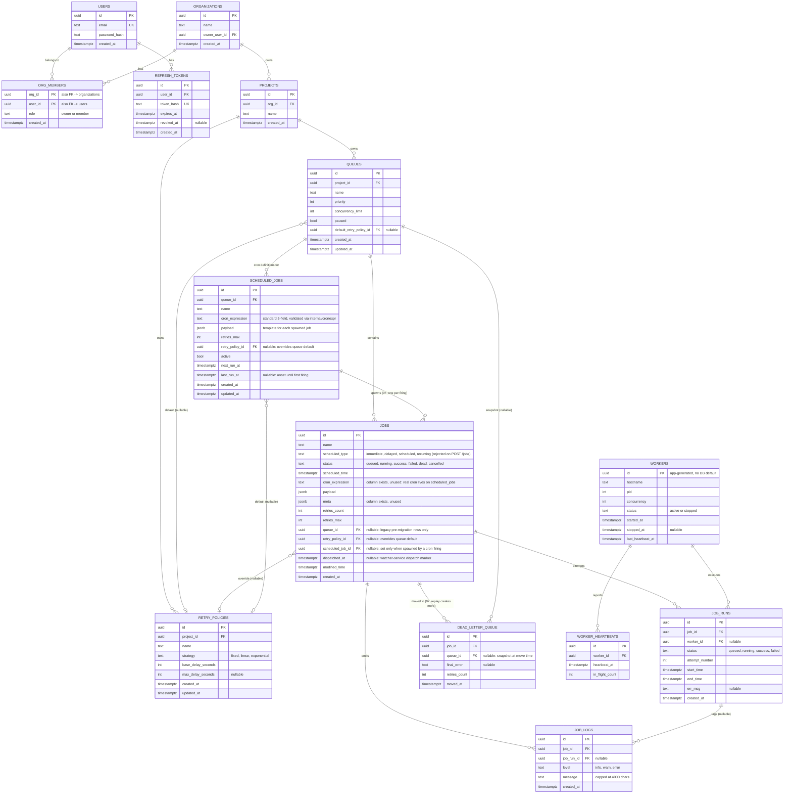

# Database Schema (PostgreSQL)

This is the schema as actually migrated (`internal/db/migrations/0001`–`0010`,
applied by `internal/db.Migrate` on every service startup), not an
aspirational design — every column/constraint below is grep-checked against
`internal/store/*.go`.

## ER diagram

## Notes on design decisions

- **UUID primary keys** everywhere — jobs/queues/workers/etc. are created by
  or referenced from multiple services (`cmd/api`, `cmd/job-service`,
  `cmd/watcher-service`, `cmd/consumer-service`) and embedded in Kafka
  message values (`internal/kafka.Producer.PublishJob` writes a job ID as
  the message body), so IDs must be generatable without a DB round trip.
  `workers.id` is the one PK the *application* generates (each
  consumer-service process picks its own on startup, before the row
  exists) rather than a DB `DEFAULT`.
- **`jobs.status`** is a `CHECK` constraint on `TEXT`, not a lookup table or
  a real Postgres `ENUM` — six fixed values that only change with a
  migration, so a separate table would be pure indirection and a real enum
  would make adding a value (e.g. a future `paused` status) a type-altering
  migration instead of a one-line `CHECK` swap (see migration `0003`, which
  did exactly this to fix an earlier mistake — `'cancelled'` was
  originally, wrongly, a `scheduled_type` value).
- **Nullable `queue_id`/`retry_policy_id` on `jobs`, `default_retry_policy_id`
  on `queues`** — additive migrations onto a schema that started flat
  (single-tenant, no queues at all). `queue_id` is `NULL` only on the
  handful of jobs created before migration `0005`; job-service's HTTP layer
  requires it on every job accepted since. This is why `GET /jobs/{id}` and
  the DLQ endpoints treat a `NULL` `queue_id` as "not found" rather than
  exposing it to any authenticated caller — there's no org to check
  membership against.
- **Cascade behavior**: `organizations → projects → queues` cascade on
  delete. `jobs → job_runs`, `jobs → job_logs`, `job_runs → job_logs`,
  `workers → worker_heartbeats`, and `jobs → dead_letter_queue` all cascade
  too — a job's full history disappears with it, which is the right default
  for a system where the job row itself is the audit anchor. The exceptions
  are deliberately `ON DELETE SET NULL`: `job_runs.worker_id` (a retired
  worker shouldn't take its execution history with it),
  `job_logs.job_run_id` (nullable regardless — see below),
  `dead_letter_queue.queue_id` (a deleted queue shouldn't erase the DLQ
  audit trail, just its queue-scoping — this also means a DLQ entry whose
  queue was later deleted becomes unreachable via the authenticated API,
  same as a `NULL` `queue_id` from the start), and
  `queues.default_retry_policy_id` / `jobs.retry_policy_id` (deleting a
  retry policy shouldn't delete the queue or job that referenced it, just
  fall back to the hardcoded default delay).
- **`job_logs.job_run_id` is nullable** even though every current write site
  passes one — reserved for a future job-level log line that isn't tied to
  one attempt (e.g. "spawned by scheduled job X"); `jobs.scheduled_job_id`
  already records that link on the job itself, so this hasn't been needed.
- **`dead_letter_queue` is append-only, not a mutable per-job record** — a
  job can be replayed (`POST /dlq/{id}/replay` deletes the entry and resets
  the job to `queued`) and then dead-letter again, producing a *second*
  row. That's deliberate: the DLQ is an audit log of dead-letter *events*,
  not a "this job is currently dead" flag (that's `jobs.status='dead'`,
  which the DLQ table doesn't duplicate or need to stay in sync with beyond
  the initial write).
- **No DB-level idempotency constraint on `job_runs`** — there's no unique
  `(job_id, attempt_number)` constraint. `attempt_number` is computed by
  the caller (`job.RetriesCount + 1` in `cmd/consumer-service`), not
  DB-assigned, so it's possible in principle for two attempt rows to share
  a number if `ClaimJob`'s guard were ever bypassed. It never actually is
  (the atomic `UPDATE ... WHERE status='queued'` is what prevents that),
  so this is accepted as redundant defense-in-depth that wasn't built, not
  a live bug — see [architecture.md](./architecture.md#concurrency--reliability-guarantees).
- **`jobs.cron_expression` and `jobs.meta`** are columns that exist in the
  schema but nothing in the Go code ever writes to. `cron_expression` was
  the flat-schema's placeholder for cron support before `scheduled_jobs`
  (migration `0010`) actually built it there instead — a job spawned by a
  cron firing carries `scheduled_job_id`, not its own copy of the cron
  expression, so this column stayed dead. `meta` isn't referenced
  anywhere. Both left in place rather than dropped since removing an
  unused nullable column buys nothing a comment doesn't already cover.
- **`scheduled_jobs` spawns ordinary `jobs` rows rather than being
  dispatched itself** — a cron definition is a template, not a queueable
  unit. This means `retries_max`/`retry_policy_id` are duplicated between
  `scheduled_jobs` and each `jobs` row it spawns (copied at spawn time,
  not referenced live) — deliberate, since a definition's config
  shouldn't retroactively change already-spawned jobs, and it means every
  downstream table (`job_runs`, `job_logs`, `dead_letter_queue`) needs zero
  awareness that a job came from a cron firing.

## Indexes

| Table | Index | Why |
|---|---|---|
| `jobs` | `(status)` | General status filtering (`GET /jobs?status=`). |
| `jobs` | `(modified_time)` | Ordering/staleness checks. |
| `jobs` | `(status, scheduled_time)` | Superseded in practice by the two partial indexes below, kept from the original migration. |
| `jobs` | partial `(scheduled_time) WHERE status='queued' AND dispatched_at IS NULL` | watcher-service's due-job dispatch query — the hottest read path at the 10K/sec target. |
| `jobs` | partial `(modified_time) WHERE status='queued' AND dispatched_at IS NOT NULL` | watcher-service's stuck-job recovery query. |
| `jobs` | partial `(queue_id) WHERE queue_id IS NOT NULL` | Queue-scoped job listing/filtering. |
| `jobs` | partial `(queue_id) WHERE status='running'` | The running-count check inside `ClaimJob`'s concurrency-limit gate. |
| `jobs` | partial `(scheduled_job_id) WHERE scheduled_job_id IS NOT NULL` | "What jobs did this cron definition spawn" queries. |
| `job_runs` | `(job_id)` | Fetching a job's attempt/retry history. |
| `job_runs` | `(status)` | Status filtering across runs. |
| `job_runs` | partial `(worker_id) WHERE worker_id IS NOT NULL` | "What has this worker run" queries. |
| `job_logs` | `(job_id, created_at)` | `GET /jobs/{id}/logs`'s chronological (oldest-first) scan. |
| `job_logs` | partial `(job_run_id) WHERE job_run_id IS NOT NULL` | Filtering logs to one attempt. |
| `queues` | UNIQUE `(project_id, name)` | Queue names only need to be unique within a project. |
| `retry_policies` | UNIQUE `(project_id, name)` | Same reasoning as queues. |
| `workers` | `(status)` | `GET /workers?status=active` and the stale-worker reaper. |
| `worker_heartbeats` | `(worker_id, heartbeat_at DESC)` | A worker's recent-heartbeats detail view, newest first. |
| `dead_letter_queue` | partial `(queue_id) WHERE queue_id IS NOT NULL` | `GET /queues/{id}/dlq`. |
| `dead_letter_queue` | `(job_id)` | Looking up a job's dead-letter history. |
| `scheduled_jobs` | partial `(next_run_at) WHERE active` | watcher-service's due-cron-definitions query — mirrors `jobs`' due-job index. |
| `scheduled_jobs` | UNIQUE `(queue_id, name)` | Same reasoning as queues/retry_policies. |
| `org_members` | `(user_id)` | "What orgs is this user in" — the membership check every scoped route runs. |
| `projects` | `(org_id)` | Project listing per org. |
| `refresh_tokens` | `(user_id)` | Token lookup/revocation on login. |

## Normalization / performance tradeoffs

- Schema is in 3NF except `jobs.payload` (`jsonb`, arbitrary and
  job-type-defined — modeling it relationally would mean a migration per
  job type, defeating the point of a generic scheduler) and `jobs.meta`
  (reserved, currently unused).
- `retries_count`/`retries_max` are denormalized directly onto `jobs`
  rather than derived from counting `job_runs` rows, because the
  retry/dead-letter decision (`RetryOrDeadLetter`) is on the hot failure
  path and must not require an aggregate query every time a job fails.
- `dead_letter_queue.queue_id` is a **snapshot**, not just a live FK
  reference — deliberately denormalized (duplicates what's derivable via
  `job_id → jobs.queue_id`) so the DLQ audit trail still shows which queue
  a job was in at dead-letter time even after that job is later reassigned
  or the queue is deleted.
- No table partitioning yet. `job_runs`/`job_logs` are the long-term growth
  vector (every attempt writes one `job_runs` row and 2–4 `job_logs` rows);
  partitioning by `created_at` (monthly) is a straightforward follow-up if
  retention becomes a problem, not needed at the dataset sizes this project
  runs at.
