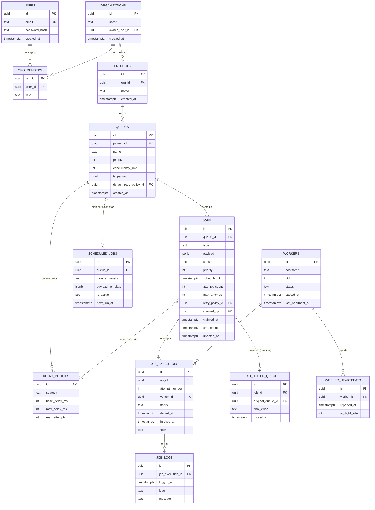

# Database Schema (PostgreSQL)

## ER diagram

## Notes on design decisions

- **UUID primary keys** everywhere: jobs are created by multiple services (API, Scheduler) and referenced in RabbitMQ messages, so IDs must be generatable without a round trip to the DB and safe to embed in messages.
- **`jobs.status`** is a Postgres `CHECK` constraint / enum-like text column with values `scheduled | queued | claimed | running | completed | failed | dead_letter`, not a separate lookup table — it's a small fixed set that changes only with a migration, so a lookup table would be pure indirection.
- **Cascading**: `organizations → projects → queues → jobs` all cascade on delete (deleting a project should not orphan its queues/jobs). `job_executions → job_logs` also cascade. `dead_letter_queue` does **not** cascade-delete when the job is deleted — it's kept as an audit trail (FK uses `ON DELETE SET NULL` and retains `original_queue_id`/`final_error` inline rather than only living behind the FK).
- **`job_executions.(job_id, attempt_number)`** has a `UNIQUE` constraint — this is the idempotency guardrail described in [architecture.md](./architecture.md): even if two workers ever raced past the atomic claim, only one could insert the execution row for that attempt.
- **Worker heartbeats**: `workers.last_heartbeat_at` is the cheap/authoritative liveness check (updated from Redis on a slower cadence, e.g. every 5s flushed from the fast Redis TTL key). `worker_heartbeats` is an optional append-only history table for the dashboard's worker detail view/metrics — not required for liveness detection itself, so it's fine for it to lag.

## Indexes

| Table | Index | Why |
|---|---|---|
| `jobs` | `(queue_id, status, scheduled_for)` | Scheduler's "what's due" query and the worker claim path both filter by these three columns together. |
| `jobs` | partial index `(status) WHERE status IN ('queued','scheduled')` | Keeps the hot polling/claim paths from scanning completed/dead jobs as the table grows. |
| `job_executions` | `(job_id)` | Fetching execution/retry history for a job (dashboard job detail view). |
| `job_logs` | `(job_execution_id, logged_at)` | Ordered log tailing for a given execution. |
| `scheduled_jobs` | `(next_run_at) WHERE is_active` | Scheduler's cron-due query. |
| `dead_letter_queue` | `(original_queue_id, moved_at)` | DLQ browsing/paging per queue. |

## Normalization / performance tradeoffs

- Schema is in 3NF except `jobs.payload` and `scheduled_jobs.payload_template`, which are `jsonb` — job payloads are arbitrary and job-type-defined, so modeling them as relational columns would mean a schema migration per job type, which defeats the point of a generic scheduler.
- `attempt_count`/`max_attempts` are denormalized onto `jobs` (duplicating what's derivable from `job_executions` + `retry_policies`) deliberately: the claim/retry decision is on the hot path and must not require a join or aggregate over `job_executions` every time.
- Old `job_logs`/`job_executions` rows are the main long-term growth vector; partitioning `jobs`/`job_executions` by `created_at` (monthly) is a straightforward follow-up if retention becomes a problem, not needed at initial scale.
